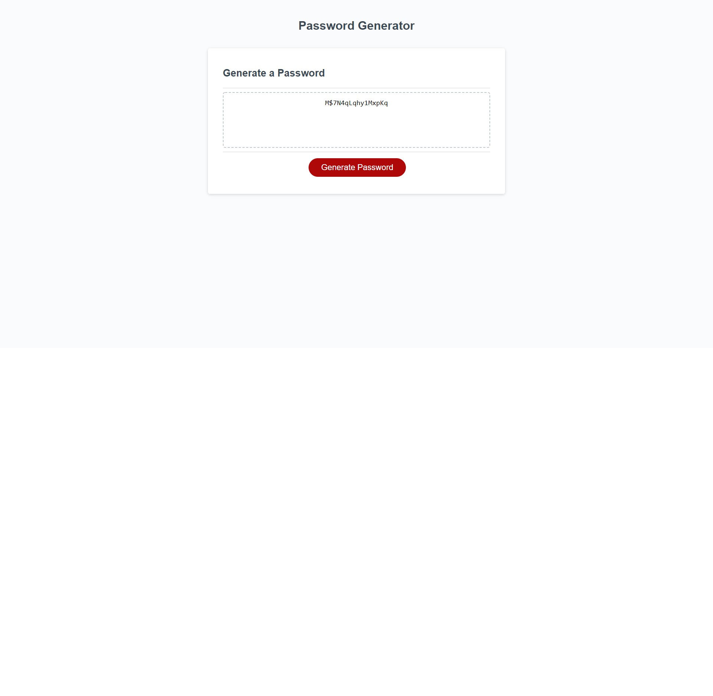

# Random-Password-Generator

## Goal:
The goal of this project was to write the Javascript code for a website that can randomly generate a password using designated parameters that are set by the user. The user should be able to indicate the desired password length, and whether or not they want numbers, special characters, upper case, and lower case letters included. Once these choices are made, the password should be displayed in the text box.

## How:
The code will begin by declaring the function that will generate the password. Variables will be named to store characters for later use. A series of alert prompts with if/else statements will allow the user to pick length of password and type of characters desired. These choices will also be stored in variables that coincide with boolean values. If the user does not choose the defined range of length or at least one choice of character, the code will be returned to the starting point with an alert informing them as much. The characters will be stored in an empty array that combines all choices made into a single array. A new empty array will also be declared to store randomly chosen characters using a for loop and random math function. The new variable will then be returned to the text box.

## Why:
This project will showcase the students knowledge of basic javascript and concepts learned from the last week of class. It will allow the student to demonstrate a physical application of the javascript functions.

## Result:
When Generate Password is clicked, the webpage now gives the user prompts to determine desired password length, whether or not they want numbers, special characters, lower case, and upper case letters. It gives an error message if the length isn't within the range of 8-128 and returns to the starting screen. It gives an error message if at least one character choice isn't made. Once choices are made, the password is generated correctly according to the users choices.

[Link to live webpage](https://niklassolomon.github.io/Random-Password-Generator/)